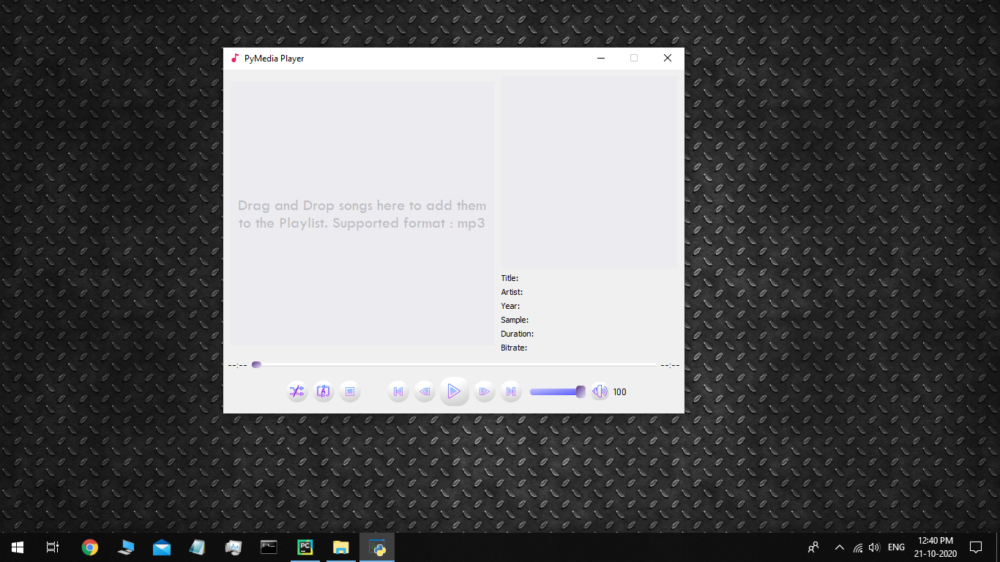
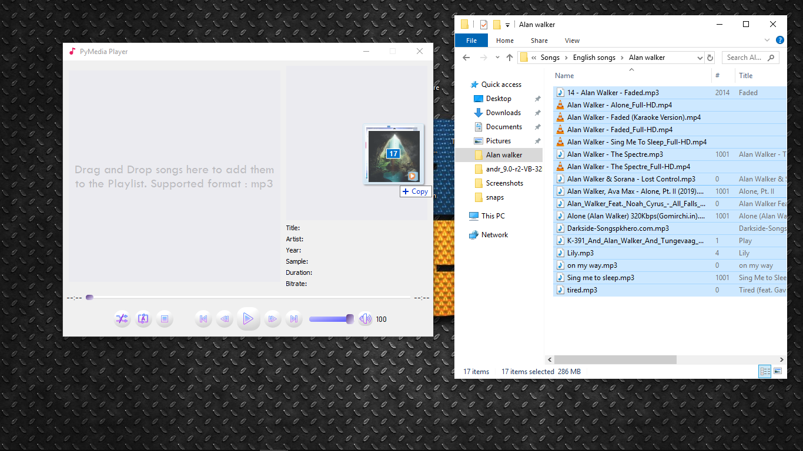
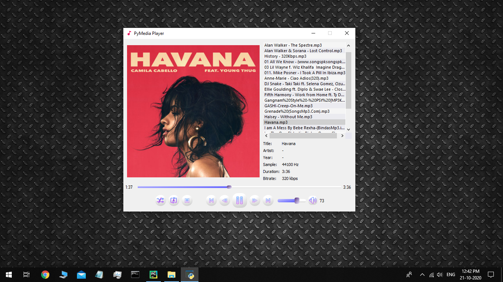
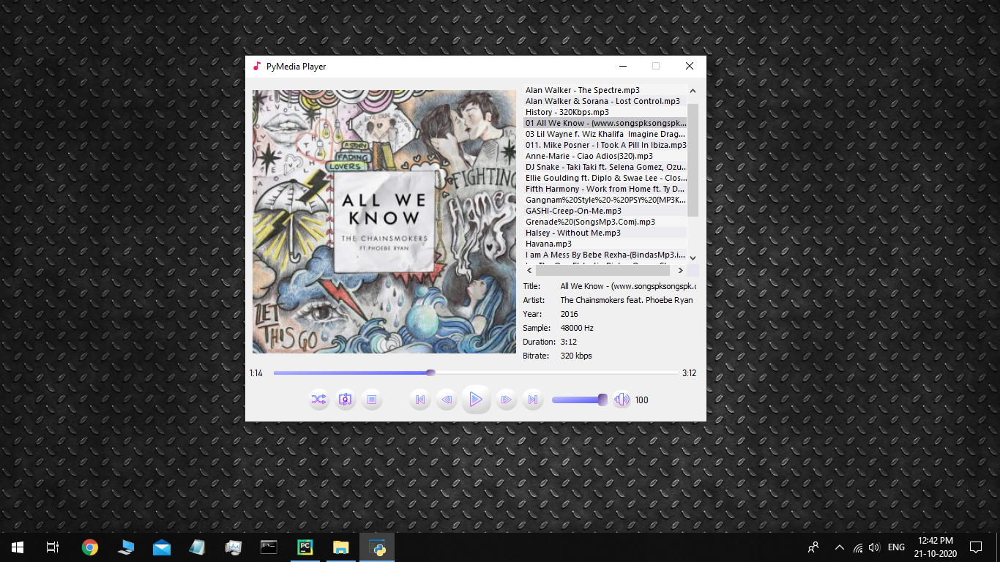
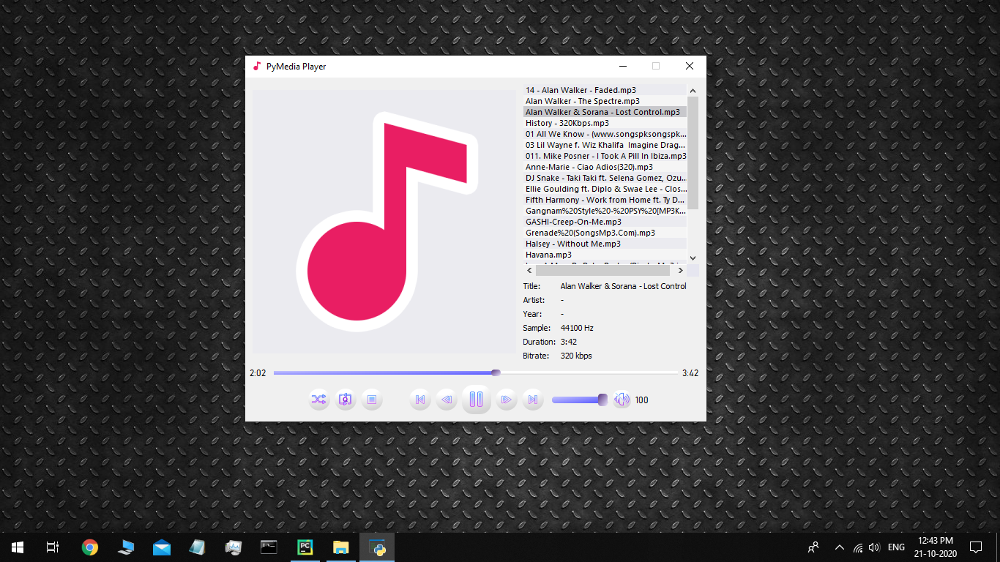

# PyMediaPlayer
A simple media player for *Windows* and *Linux* made in Python using the PyQt5 module. It is a desktop application which can play songs and also display its metadata similar to any other media playback software.

# Supported formats
It uses *Windows Media Foundation* in Windows platform, so it can play most of the supported audio formats such as **mp3, wav, aac, wma, m4a, ac3, amr, ts, flac**, .etc.

Some minor issues regarding some special formats can arise, but its all up to the media plugin that the host Operating System uses. This application is totally based on the host OS, so results can vary depending on the type and version of the host OS. 

# Features
1. Background Playback.
2. Wide range of supported audio formats
3. Automatic Playback when idle.
4. Drag and drop multiple files at once.
5. Media Controls - Next song, Previous song.
6. Playback Controls - Play/Pause, Stop, Rewind/Fast-Forward, Skip back-forth.
7. Output Controls - Mute volume, Change Playback Volume.
8. PlayList Features - Repeat All, Repeat Queue, Repeat None, Repeat One, Shuffle All.
9. Display Audio Info - Album Art, Title, Artist, Year, Sample Rate, Duration, Bitrate.
10. Elapsed/Remaining Time Display.
11. Realtime Progress Seek Bar.
12. Supports keyboard shortcuts for controlling the app.
13. Open audio files from within the app.
14. Export/import Playlist files.

# Snaps

# Shortcuts
* Open Files - <kbd>Alt + O</kbd>
* Play/Pause - <kbd>Space</kbd>
* Stop Playback - <kbd>Alt + X</kbd>
* Previous Song - <kbd>Alt + P</kbd>
* Next Song - <kbd>Alt + N</kbd>
* Toggle Mute - <kbd>Alt + M</kbd>   
* Toggle Shuffle - <kbd>Alt + S</kbd>   
* Playback type - <kbd>Alt + R</kbd>   
* Rewind (-2s) - <kbd>Ctrl + Alt + P</kbd>
* Fast Forward (+2s) - <kbd>Ctrl + Alt + N</kbd>

Shortcuts can be used only when app is in *focus*

# How to Use
## Straight-Forward (Simple) Method
1. Clone the repository on the local machine.
2. Run *PyMediaPlayer.py* file.
3. Drag and drop *Audio only* files onto the Main App Window, or click on the *Open* button on the controls panel at the bottom.
4. Playback will start automatically from the first file.
5. Use the control buttons to control the app's capabilities.
6. Play any song by clicking on the song in Playlist view.
7. Shortcuts can be used to control the app.

## Advanced Method
1. Clone the repository on the local machine.
2. Open *songs_adder.py* in an IDE.
3. Edit *song_path* variable value to your own music directory.
4. You can read all the comments in the above file and take required decisions.
5. After doing the changes, run the above file.
6. If the App is found running already, it will start adding songs one-by-one from the specified *song_path* to the App's Playlist. If the App wasn't running, it will start a new instance and add all songs to that new instance.
7. It will take some time for the script to complete, depending on the number of songs present in the specified *song_path*.
8. Drag n Drop, and all other functionalities will work as normal.

# Contribution
This is an individual-only project.
Any contribution to this project will be highly appreciated.
There might be some issues regarding Linux/macOS. So, anyone interested is welcomed.
Any bug fix, any edits, any new ideas or any issues are welcomed.
Please read [CONTRIBUTING.md](CONTRIBUTING.md) for more info on contribution.

# Connect with me
[YouTube](https://www.youtube.com/c/EverythingComputerized)

[Linkedin](https://www.linkedin.com/in/charitra1022/)
